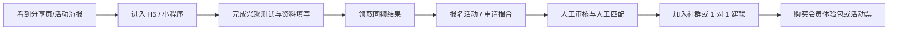

# 5 万内低成本验证版

## 1. 目标

这不是“阉割版 dating App”，而是一套 `5 万元以内` 的市场验证方案，用最低成本回答 4 个最关键的问题：

- 这个圈层的人会不会来
- 他们愿不愿意认真填写资料
- 他们愿不愿意参加活动或接受撮合
- 他们愿不愿意为更高质量匹配付费

核心思路：先不做完整 `App`，改成 `小程序/H5 + 人工审核 + 人工撮合 + 活动报名 + 轻会员预售`。

## 2. 产品形态

### 2.1 首版定位

首版不做“完整线上 dating 平台”，而做成一个偏 `兴趣社交 + 同城活动匹配` 的验证产品。

建议对外表达：

- 同城同频认识
- 兴趣局与轻约会
- 圈层活动匹配

不要一开始强调：

- 大规模即时约会
- 强私密聊天
- 复杂陌生人社交

### 2.2 首版载体

二选一即可：

- `微信小程序`：适合分享、活动报名和裂变
- `H5 网站`：更便宜更快，适合先跑投放和社群裂变

若预算非常紧，优先 `H5`。

## 3. 只做这些功能

### 3.1 必做功能

- 品牌介绍页
- 用户报名页
- 轻人格/兴趣测试
- 个人资料收集
- 匹配意向问卷
- 同频结果页
- 活动报名页
- 会员预售或早鸟资格页
- 客服/社群承接入口

### 3.2 后台最小能力

- 用户列表
- 标签筛选
- 人工审核标记
- 匹配状态管理
- 活动报名导出
- 付费用户记录

### 3.3 明确不做

- 原生 App
- 即时聊天 IM
- 真人视频认证
- 复杂推荐算法
- 动态社区
- 语音房/匿名房
- 多城市同时铺开

## 4. 用户流程

## 5. 人工替代技术的做法

### 5.1 匹配

不做算法，先用人工半自动撮合：

- 按城市筛选
- 按兴趣标签筛选
- 按关系意向筛选
- 按活跃度和资料完整度排序

工具可以直接用：

- 飞书多维表格
- Airtable
- Notion + 表单
- 企业微信标签

### 5.2 审核

不做昂贵风控系统，先做轻人工审核：

- 头像人工看一遍
- 自我介绍敏感词过滤
- 手机号验证
- 高风险资料人工二次确认

### 5.3 建联

不做站内 IM，先用外部承接：

- 企业微信
- 微信群
- 活动群
- 人工客服 1 对 1 拉通

### 5.4 会员

不做复杂订阅系统，先卖：

- 早鸟会员
- 城市优先匹配资格
- 活动优先报名资格
- 1 对 1 撮合服务

## 6. 建议的收费方式

### 6.1 首版收入结构

- `9.9-19.9` 元：测试报告升级版
- `29.9-69.9` 元：早鸟会员资格
- `49-99` 元：城市活动票
- `99-199` 元：人工精选撮合包

### 6.2 首版不要卖什么

- 高价年费会员
- 复杂连续订阅
- 太多虚拟道具

先验证“有人付”，比验证“ARPU 最大化”更重要。

## 7. 5 万内预算拆解

### 7.1 极简自驱版：`1.5 万 - 3 万`

适合创始人自己盯产品和运营。

- 域名、服务器、基础 SaaS：`1000-3000`
- H5 或小程序模板开发：`5000-12000`
- 设计与海报：`2000-5000`
- 社群/客服工具：`500-2000`
- 首批活动与种子用户补贴：`5000-10000`
- 备用金：`2000-5000`

### 7.2 相对稳妥版：`3 万 - 5 万`

更适合你想认真试一轮单城验证。

- 产品与页面设计：`5000-8000`
- H5/小程序开发：`12000-20000`
- 表单与后台工具集成：`2000-5000`
- 域名、云资源、短信、基础存储：`2000-4000`
- 活动物料、海报、KOL 小合作：`5000-10000`
- 法务文案、协议模板、杂费：`3000-5000`
- 机动预算：`3000-5000`

### 7.3 绝对不要超预算的地方

- 不招完整技术团队
- 不做原生双端 App
- 不自研聊天系统
- 不自研推荐算法
- 不一开始接入重型 AI 能力

## 8. 6-8 周启动节奏

### 第 1 周

- 明确圈层定位和首个城市
- 确定品牌名、主张和视觉基调
- 冻结首版只做 `8-10` 个页面

### 第 2 周

- 完成测试题和用户报名表
- 完成同频结果页文案
- 完成活动页和会员预售页文案

### 第 3-4 周

- 开发 H5 或小程序
- 接好表单、支付、数据收集
- 搭建飞书/Notion 运营后台

### 第 5 周

- 小范围邀请种子用户试填
- 修正测试题和资料字段
- 跑第一轮人工撮合

### 第 6-8 周

- 开第一场小型活动
- 观察报名率、到场率、付费率
- 判断是否值得扩城市或进入 App 阶段

## 9. 成功标准

只看最关键的验证指标：

- 报名转化率
- 资料填写完成率
- 愿意加入社群的比例
- 愿意参加活动的比例
- 愿意付费的比例
- 人工撮合后的有效建联率

建议判定门槛：

- 测试/报名完成率 `> 35%`
- 社群加入率 `> 20%`
- 活动报名付费率 `> 5%`
- 精选撮合付费率 `> 2%`

达到这些，再考虑做更重的产品。

## 10. 适合你的版本建议

如果你现在希望把风险压到最低，我建议你直接选这个组合：

- `H5` 而不是原生 App
- `单城市` 而不是多城市
- `兴趣测试 + 活动报名 + 人工撮合`
- `企业微信/微信群承接`
- `早鸟会员预售 + 活动票` 作为首版收入

这是 `5 万内` 最容易跑通、也最接近真实需求验证的一版。

## 11. 下一阶段升级条件

只有在以下情况出现时，才建议进入正式 App 开发：

- 连续 `2-3` 场活动都能稳定招满人
- 用户开始主动催更在线匹配能力
- 人工撮合工作量显著上升
- 已经有稳定付费用户和复购活动用户

在这之前，先别急着烧钱做完整平台。
