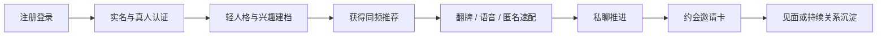

# 产品需求文档 PRD

## 1. 产品概述

### 1.1 产品名称

暂定名：`同频局`

### 1.2 产品定位

一款面向中国大陆 `18-30` 岁泛亚文化人群的即时约会产品。产品围绕“真实、安全、同频”三件事展开，通过轻人格建档、兴趣标签、实时互动与强信任机制，帮助用户从认识到破冰，再到约会推进。

### 1.3 目标用户

- 核心用户：一二线城市 `18-30` 岁泛亚文化年轻人
- 场景用户：漫展、市集、摄影、桌游、livehouse、独立咖啡馆、社团活动参与者
- 关系诉求：即时约会、同城认识、兴趣陪伴、朋友到恋人的自然转化

### 1.4 产品目标

- 在 `10` 分钟内帮助新用户完成认证和兴趣建档
- 在首日内为新用户提供至少 `1` 次有效破冰机会
- 在首版验证“注册 -> 认证 -> 首聊 -> 付费”的完整闭环

## 2. 产品原则

- `真实`：强实名、真人认证、头像资料审核、风险用户分层治理
- `安全`：举报、黑名单、敏感行为监控、未成年人隔离、约会安全提示
- `同频`：兴趣与关系期待优先于颜值粗暴筛选
- `轻决策`：人格测试不做重心理学，只服务于匹配效率
- `快推进`：每个环节都要缩短从匹配到开聊的距离

## 3. 用户旅程

## 4. App 端模块设计

### 4.1 注册与信任

目标：让用户快速完成进入门槛，同时建立平台基本安全感。

功能模块：

- 手机号注册与验证码登录
- 实名认证接入
- 真人认证：活体检测、手势视频或指定动作
- 头像与资料审核
- 年龄校验与未成年人隔离
- 风险分层：正常、观察、限制、封禁
- 举报中心、黑名单、申诉入口

关键规则：

- 未完成真人认证的用户不能主动发起高风险互动
- 高风险用户限制语音、私聊频次与内容曝光
- 新用户资料必须经过审核后进入推荐池

### 4.2 人格与兴趣建档

目标：用最少的题目和标签，形成足够可用的推荐画像。

字段设计：

- 基础资料：昵称、年龄、性别、城市、职业/学校
- 关系期待：认真恋爱、朋友到恋人、即时约会、搭子陪伴
- 兴趣标签：二次元、摄影、桌游、livehouse、手作、市集、cos、乙游等
- 轻人格题：表达方式、社交节奏、作息、线下偏好
- 约会偏好：同城范围、可接受距离、时间偏好、活动类型

交互要求：

- 题目总时长控制在 `3-5` 分钟
- 采用卡片式单题流，避免长表单
- 建档完成后直接生成“同频画像摘要”

### 4.3 发现与匹配

目标：让用户持续获得“值得点开”的同频对象。

推荐形态：

- 今日推荐流
- 同城附近
- 在线速配
- 新人专区
- 圈层精选

匹配机制：

- 基础权重：城市、年龄、认证完整度
- 兴趣权重：圈层标签重合度、活动偏好重合度
- 行为权重：回复率、举报率、资料完整度、活跃时段
- 商业权重：会员加速、城市漫游、曝光增强

功能点：

- 左右翻牌
- 超级喜欢
- 语音破冰
- 匿名速配房
- 同城活动推荐卡

### 4.4 聊天与约会推进

目标：提高首聊率和有效对话率，减少“匹配后沉默”。

功能模块：

- 私聊
- 预设破冰问题
- 快捷兴趣提问
- 闪图/阅后即焚
- 语音消息与实时语音
- 约会邀请卡：时间、地点类型、活动偏好
- 见面意向确认：想见、再聊聊、暂不考虑

机制设计：

- 新匹配 `24` 小时内提供系统破冰提示
- 高匹配度对象优先展示共享话题
- 首次线下邀约前弹出安全提醒和举报入口

### 4.5 社区与内容

目标：提供信任补充和关系预热，不做重内容平台。

内容域：

- 动态广场
- 圈层话题
- 城市活动帖
- 优质用户精选
- 官方活动专题

治理要求：

- 评论反骚扰拦截
- 低俗内容识别
- 高风险词审核
- 用户可关闭陌生评论或私信

### 4.6 会员与付费

目标：突出效率与身份感，不靠单点收费破坏体验。

`VIP` 权益：

- 谁看过我
- 更多筛选条件
- 每日更多翻牌次数
- 已读增强
- 语音优先匹配

`SVIP` 权益：

- 无限翻牌
- 隐身访问
- 城市漫游
- 曝光增强
- 精选位优先展示

道具权益：

- 超级喜欢
- 曝光加速卡
- 位置漫游卡
- 语音优先卡

## 5. 小程序模块设计

定位：小程序只做轻链路，不承接核心私密社交。

### 5.1 拉新入口

- 品牌介绍页
- 邀请码注册页
- 新人福利页
- 下载 App 引导页

### 5.2 轻测试

- 轻人格测试
- 兴趣标签测试
- 匹配报告预览
- 分享海报生成

### 5.3 轻匹配

- 少量推荐卡浏览
- 城市活动报名
- H5 风格对象介绍页

### 5.4 召回回流

- 会员促销通知
- 消息提醒
- 活动提醒
- App 跳转深链

## 6. 后台与运营系统

### 6.1 用户审核后台

- 实名认证结果查看
- 真人认证审核
- 头像资料审核
- 风险标签查看与处置

### 6.2 内容治理后台

- 动态与评论审核
- 举报工单流转
- 敏感词库维护
- 申诉处理

### 6.3 匹配策略后台

- 推荐权重配置
- 标签池管理
- 冷启动策略配置
- 城市灰度开关

### 6.4 活动运营后台

- 线上专题管理
- 线下活动发布
- 报名审核
- 门票核销

### 6.5 商业化后台

- 会员套餐
- 优惠券
- 支付订单
- 续费分析
- AB 定价实验

### 6.6 数据分析后台

- 注册漏斗
- 认证漏斗
- 匹配和首聊转化
- 留存看板
- 付费漏斗
- 举报与风控看板

## 7. 页面结构建议

`App` 一级导航建议：

- 首页：推荐流
- 速配：语音/匿名/在线房
- 动态：轻社区
- 消息：聊天、系统通知
- 我的：资料、认证、会员、设置

`小程序` 一级结构建议：

- 首页
- 测试
- 活动
- 我的

## 8. MVP 范围

首版只做以下高优先级模块：

- 手机号注册
- 实名与真人认证
- 轻人格建档
- 今日推荐流
- 翻牌匹配
- 私聊
- 会员订阅
- 举报黑名单
- 基础审核后台

二期再补：

- 语音速配
- 匿名房
- 动态广场
- 活动报名
- 城市漫游与高级道具

## 9. 核心指标

- 注册转化率
- 认证完成率
- 首日首聊率
- 匹配到有效对话转化率
- `D1/D7` 留存
- 会员付费率
- 举报率与封禁率

## 10. 验收标准

- 新用户在 `10` 分钟内可完成认证和建档
- 新用户在当日可看到至少 `20` 个可浏览对象
- 完成一次匹配后可在 `1` 分钟内进入聊天
- 举报和拉黑入口在资料页、聊天页和动态页均可到达
- 会员权益页对 `VIP` 与 `SVIP` 差异展示清晰
